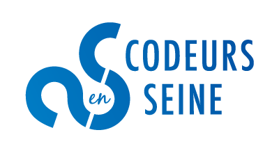

# Site pour la conférence [Codeurs en seine](http://www.codeursenseine.com)



Codeurs en Seine est une journée de conférences gratuite qui se déroule à Rouen,
pour découvrir, apprendre et partager autour du monde du développement.


## Contribution

Vous trouvez que quelque chose manque au site ? ➡️ les pull requests sont les bienvenues !

### Execution en local
#### Requis
Pour installer jekyll : https://jekyllrb.com/docs/installation/#ubuntu

Installation des dépendances requises :

* ```gem install bundler```
* ```bundle```

#### Démarrage du site en local 
* ```jekyll serve --watch``` 

ou 

* ```bundle exec jekyll serve --watch```

Essayez cette commande si vous n'arrivez pas à lancer le site : `bundle update`

### Ajout de nouveaux orgas

- Pull la dernière version du git (branche `gh-pages`)
- Modifier le fichier `_data/edition2018/organisateurs.yml 
- Ajouter la photo (même nom que défini avant dans le yml) en 100x100px dans `images/edition2018/organisateurs`
- Puis commit et push sur la branche

### Ajout d'un meetup

- Pull la dernière version du git (branche `gh-pages`)
- Créer un fichier a la date du jour (important pour voir la publication) dans _posts/meetups en copiant/collant le fichier `2001-01-01-example-meetup.md`.   
Exemple: `2018-12-25-meetup.md`
- Modifier ce fichier `.md` avec les bonnes informations
- Ajouter la photo du speaker dans `images/meetups/speakers`
- Puis commit et push sur la branche
